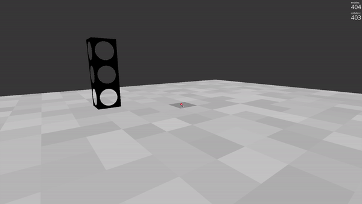

# SMAC Simulation (Ursina Engine)
A Python-based simulation using the Ursina Engine that showcases inchworm behavior in a Minecraft-like environment. This project extends beyond basic game mechanics, allowing automated structure construction via simulated inchworm movement.

# Software Requirements 
This simulation was developed using Python 3 with Python 3.12 being strongly recommended. Using an earlier version of Python may cause significant bugs.For more information visit: https://www.python.org/downloads/release/python-3120/ 

## Download Python & Installation Instructions
1. Download Python 3.12 by following the commands below. Courtesy of https://medium.com/@KNuggies/install-python-3-12-on-ubuntu-c7674df5f623

It is recommended to install Python outside your workspace to avoid conflicts.
`sudo apt update && sudo apt upgrade -y`

`python3 --version` (Check your current Python version)

`sudo apt-get install build-essential gdb lcov pkg-config \libbz2-dev libffi-dev libgdbm-dev libgdbm-compat-dev liblzma-dev \libncurses5-dev libreadline6-dev libsqlite3-dev libssl-dev \…` (Ensure all required dependencies are installed before proceeding)

`wget -c https://www.python.org/ftp/python/3.12.4/Python-3.12.4.tar.xz`

`tar -Jxf Python-3.12.4.tar.xz`

`cd Python-3.12.4`

`./configure --enable-optimization`

To have 3.12 run alongside your current python version in Linux, make sure to run the following so your system doesn't die. -j divvies the processes to the number of threads you choose (16)

`make -j16 all`

`sudo make altinstall`

2. Create the virtual environment in your preferred IDE. 
In VSCode, press Ctrl + Shift + P, type 'Python: Select Interrpreter', and at the top, there should be an option to select '+ Create Virtual Environment...' and use .venv

In the **virtual environment**, install pip using:
`sudo apt-get install python3-pip`

Important: To ensure you're using Python 3.12, run all Python commands as: 
`python3.12 -m` 

Once Python and the virtual environment are set up, install the required packages:
`pip install ursina numpy colorama`

## How to Download and Run ⬇
1. Make sure you have Python installed and Ursina too. If you have Python, go to the Command Line and type `pip install ursina`.
2. Download this Repository (or clone it).
3. Extract the ZIP file (if downloaded manually) or clone the repository using:
`git clone <repo_link>`
4. Navigate to the project folder and run:
`python sim.py`

# Running the Simulation
Once all requirements are installed, you can start the simulation, which includes inchworm movement, dynamic pathing, and smart block interactions. This simulation assumes that all communication protocols (block-to-block, inchworm-to-block) are functioning correctly.

## How to edit the simulation ?
config.py file controls the following:
1. Grid size of the map
2. Locations of block depots
3. Location of the seed block
4. Initial position and orientation of the inchworms' leading leg

Through these variables, you can customize the simulation.

## Simulation Initialization
To begin, you can either build your own structure in the workspace or generate a pre-existing one.

### Non-Seed Block Initialization
Initializing the map spawns the following objects:
1. Block depot
2. Inchworm's leading foot location in their respective orientation(s)
4. Path for inchworm to go to seed block

This process calculates the entire path and steps for inchworm to build given structure.

### Seed Block Initialization
Initializing the map spawns the following objects:
1. Block depot
2. Seed block
3. Inchworm(s) foot locations in their respective orientation(s)
4. Path(s) for inchworm(s) to go to seed block

This also is compatible for multiple inchworms.

## Controls ⌨
| Key | Description |
| :---: | :---: |
| `WASD` | Movement |
| `Mouse` | Camera Rotation |
| `Space` | Jump |
| `Left Click` | Place Block |
| `Right Click` | Remove Block |
| `L` | Identify known substructures |
| `N` | Move the inchworm to next block |
| `P` | Start non-seed block initialization. |
| `G` | Generate pyramid structure |
| `K` | Generate SMAC 6 demo structure |
| `M` | Spawn inchworms |
| `F` | Enable flying and different camera angles |
| `QE` | Fly up/down |
| `1234` | Switch cameras |
| `ESC` | Exit simulation |

## Demo Usage Steps Summary
1. Build any structure you want to display in the workspace or generate pre-existing ones. 
2. Identify known substructures (`L`), if there is a known structure it will change the color of the substructure
3. Depending on the initialization you want:
    a. Non-Seed Block: Calculate a path for inchworm (`P`) and spawn the Block Depot and inchworm foot.
    b. Seed Block: Spawn inchworm(s) (`M`), the seed block, and the block depot.
    Either will create or overwrite the steps.txt with the current list of steps.
4. Press `N` and watch the inchworm move to the next block!

Note: You must press `L` then `P` or `M` (only once) for the simulation to work as intended.

Note: If you walk off the edge of the field you will fall and will need to either fly to get back up or restart the simulation

Note: Each green surface represents each leg of the inchworm

Note: For multiple inchworms, they will have different color paths

Automation: Run press_n.py to automate pressing n. You must give permission to the environment that you are running on to allow keyboard press. 

# About ℹ
This is based on Ursina gaming engine for more information please visit: https://github.com/SpyderGamer/Minecraft-with-Python/releases